## SEFFER — Автоматическое переименование фото (Double YOLO)

Интеллектуальная система для обработки фотографий: детекция объектов и распознавание текста (OCR). Работает локально, не требует наличия интернета (кроме первой установки).

### 🚀 Быстрый запуск через Docker. 

#### Первый запуск (Установка):

1. Вам не нужно устанавливать Python или зависимости. Просто запустите готовую сборку из облака. Используйте эту команду один раз, чтобы скачать приложение и настроить связь с вашей папкой:

`bash`

`docker run -d --name seffer_app -p 8501:8501 -v "C:\ВАШ_ПУТЬ:/app/output" ghcr.io/olgam-ds/seffer_auto_naming:latest`

**Важно:** Замените C:\ВАШ_ПУТЬ_К_ФОТО на реальный путь к папке на вашем компьютере, куда вы хотите сохранять результаты обработки. Docker Desktop должен быть открыт в процессе установки.

2. Наберите во вкладке браузера: http://localhost:8501

#### Ежедневное использование:

1. Просто откройте Docker Desktop, перейдите во вкладку Containers и нажмите кнопку Start на контейнере с именем seffer_app.

2. Наберите во вкладке браузера: http://localhost:8501

### 🛠 Технологии
- YOLOv11-obb (Object Detection)
- YOLOv11 OCR (Text Recognition)
- Streamlit (Web Interface)
- Docker (Containerization)
### 📁 Структура проекта
- app.py — веб-интерфейс на Streamlit.
- best_obb.pt / best_ocr.pt — обученные веса моделей YOLO.
- pipeline.py — основная логика обработки изображений.
- metrics — результаты работы модели (crop, ocr, accuracy) на всем датасете клиента (1200 фото).
- demo_photos — набор фотографий для теста работы приложения.
- METHODOLOGY.md — описание проекта, анализ моделей, работа приложения. 
### 🖥 Системные требования и характеристики

Проект оптимизирован для работы на CPU (центральном процессоре) и не требует наличия GPU.

| Параметр | Значение |
| :--- | :--- |
| **Вес при скачивании** | ~4.5 GB |
| **Место на диске** | ~13 GB |
| **RAM (рекомендуемо)** | 4 GB+ |
| **Архитектура** | x86_64 |

# Описание проекта
## Задача
Разработка десктопного приложения на основе машинного зрения для распознавания числовых данных на фото для последующего переименования в соответствии с распознаными данными и систематизации файлов. Приложение должно работать локально на ПК без необходимости подключения к сети.

**Цель проекта:** Упростить и ускорить процессы ручного переименования и систематизации фото в полевом фотоархиве за счёт их автоматизации.
 
## Данные
**Датасет** - 1200 фото. Состоит из снимков, сделанных в естественных условиях при дневном освещении.

**Особенности:** обнаружены случаи когда:
- на фото совсем отсутствует табличка с данными (около 3% от всего датасета);
- табличка попала в кадр частично (с потерей данных) или данные частично закрыты внешними предметами (ветками, решетками);
- ошибочно выставленные данные (табличку перенесли на новый объект, а цифры не сменили)
- устройство записи сохранило изображение в вертикальной ориентации (4000x6000), но при этом само содержимое кадра оказывается перевернутым. При этом в метаданных EXIF отсутствует корректирующий тег Orientation
- угол наклона таблички в кадре может встречатся любой, кроме того отмечены серьезные перспективные искажения

## Обучение моделей
### Детекция OBB (Oriented Bounding Boxes)
Для детекции выбрана легкая и быстрая предобученная yolo11n-obb.pt. Для повышения точности использовали OBB (ориентированные рамки) вместо стандартных горизонтальных. Это позволяет модели лучше обрабатывать повернутый текст и перспективные искажения. Аннотирование изображений: Roboflow. Размечены первые 200 фото из датасета по методике obb. Аугментированы х3. На полученом датасете обучена модель с дополнительной аугментацией.

 100 эпох: mAP50  - 0.995; mAP50-95 - 0.917

 Анализ Confusion Matrix на валидационной выборке 40 фото показал идеальную разделимость классов. Модель безошибочно идентифицирует целевой объект (tab), не допуская ложноположительных срабатываний (False Positives) и не пропуская объекты, принимая их за фон (False Negatives). Однако, для обучения модели были взяты только первые 200 фото датасета, проверка модели на всем датасете в разделе анализ моделей
 
 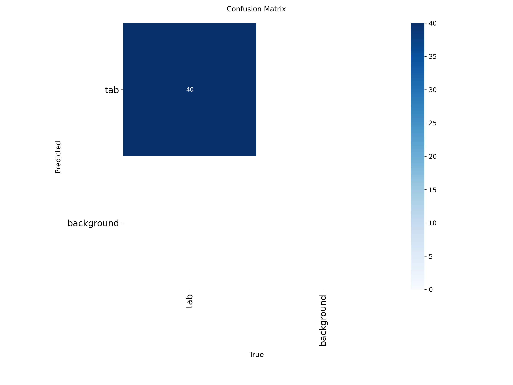
 Примеры кропов (кропы развернуты по точкам в пайплайне):
 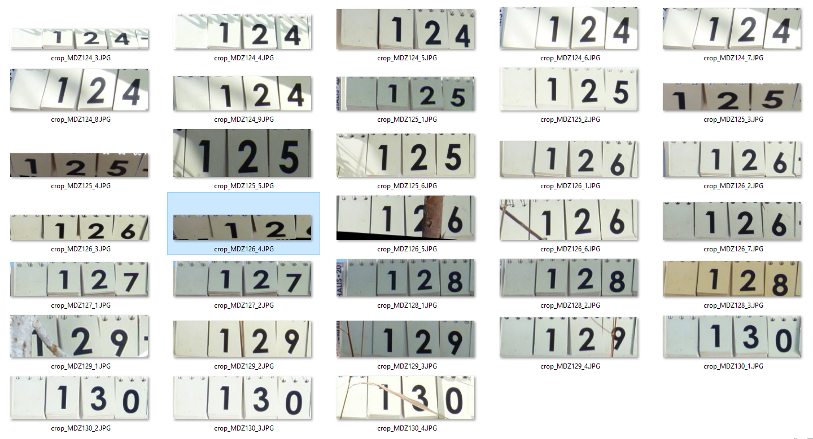
### Распознавание OCR (Optical Character Recognition)
Для распознавания выбрана yolo11n.pt. Она обучена в 2 этапа: 
 - 1_этап - обучение на синтетическом датасете (символы). Сгенерировали датасет (15 000), шрифт GOTHICB.TTF (1-9, a, b, c, d, e) (указано в ТЗ) с поворотами, тенями, размытостями, перепадами освещения и пр.

 Датасет выглядит так:
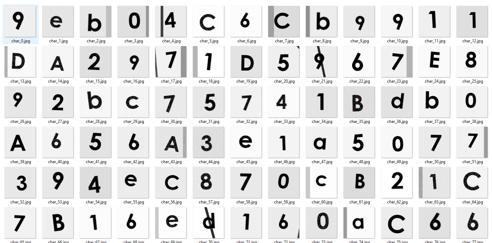
 - 2_этап - дообучение на другом синтетическом датасете (набор символов на подложке имитирующий реальные кропы табличек). Сгенерировали 8000 с использованием всех необходимых эффектов имитирующих реальные искажения. 

 10 эпох: mAP50  - 0.995; mAP50-95 - 0.987

 Датасет выглядит так:
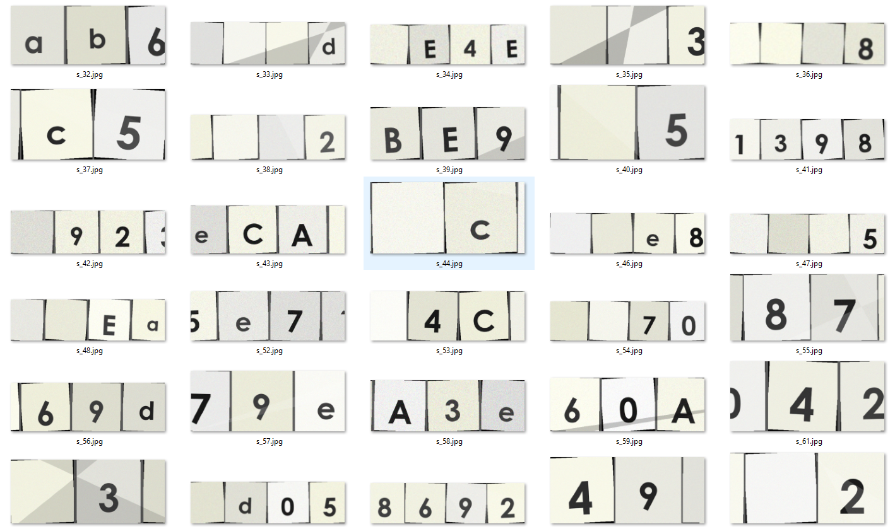

## Пайплайн
Включает в себя кроме работы моделей:
- предповорот изображения по EXIF
- кроп получается в исходном разрещении
- разворот/выпрямление кропа по точкам (что стало возможно благодаря использованию obb)
- несколько геометрических фильтров, оптимизированных опытным путем.

Пайплайн принимает датасет с фото, обрабатывая последовательно каждую фотографию сохраняет кропы и результаты ocr в отдельные папки, которые можно при желании выгрузить вместе с результатами. А так же формирует датасет-отчет (id, старое имя файла, распознаное значение, уверенность модели). Файлы с отсутствующими или не распознанными кропами помечаются "!" вначале имени файла и помещаются в отчет в столбец с распознаным значением. Результаты распознавания дополняются "0" до получения 4-х разрядов.

## Анализ моделей 
 - Проверили работу пайплайна на всем датасете (1200 фото). Конечно, это не совсем корректно для модели детекции, так как она обучалась на первых 200 фото, но для сравнения с аналогичными моделями желательно использовать весь датасет. Тем белее, что модель ocr обучалась на синтетике и не видела ни одной реальной фотографии. 
 - Для реальной оценки работы модели с точки зрения клиента лучше метрики, чем Accuracy не придумать. По ней он может понять объем правильных ответов с учетом ошибок модели и некачественных данных. Метрику считали по таким условиям: если первоначальное имя файла и предсказанное значение хоть в чем-то не совпало - ошибка. И не важно, это ошибка самой модели или в кадре вообще не было таблички или данные были частично скрыты. И несмотря на то, что в таких случаях у модели даже не было шансов, все равно - ошибка! 

 То есть ошибка считается не по каждому символу, а по всей табличке целиком! Нет на фото табличке - ошибка, некачественное фото (в изначальный кадр не попала часть цифр или цифра закрыта веткой) - ошибка, модель не распознала (или плохо распознала) хоть 1 символ на табличке - ошибка! 

 **МЕТРИКИ**
 - **ACCURACY** всего пайплайне целиком и всего датасета целиком (1200кадров): **88.83%**
 - Для оценки отдельно модели OCR отфильтровали датасет без "!", то есть те, где кроп прочитан. 
 - **ACCURACY** чистое распознавание (1130 кадров): **94.34%**

 
 - У модели детекции на всем датасете, конечно, не такие отличные метрики, как на валидации, потому что она встретила данные, которых совсем не было в ее обучении (первые 200 фото) даже с аугментацией.
 - Основные ошибки детекции: модель частично обрезает таблички, которые сфотографированы крупно, плохо работает с перевернутыми вверх ногами фото, не лучшим образом строит рамку при сильной перспективе
 - Основные ошибки OCR: Есть фото, где табличка лежит под углом до 90 грд, но надписи на ней ориентированы в другую сторону. Поэтому при правильном (относительно таблички) повороте кропа, надпись оказывается вверх ногами (а шрифт у нас симметричный (6=9)); еще из-за низкого порога модель немного галюцинирует на попавшем в кроп мусоре.

 Данные проблемы модели можно улучшить при следующем релизе. Предложения по улучшению см. раздел "Что можно улучшить" см ниже
 - Детально расчет метрик, кропы и ocr можно посмотреть в папке проекта metrics

 Визуально это выглядит так:
 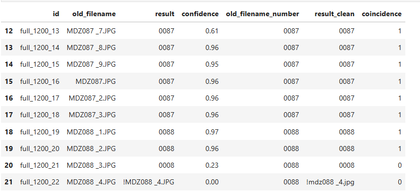
 - Там же выведен ТОР-5 наиболее уверенных ошибок модели.
 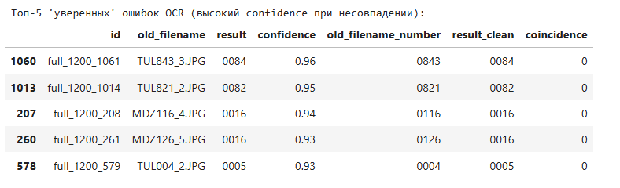

 **ВЫВОД:** модель ошибается не часто, но иногда очень уверенно, поэтому ранжировать по степени уверенности модели - это путь к совершению ошибок, которые никто не заметит! Тем более есть фото на которых просто отсутствует часть информации и модель очень уверенно предсказывает только видимую оставшуюся часть.

 Вот, например, одна из уверенных ошибок:
 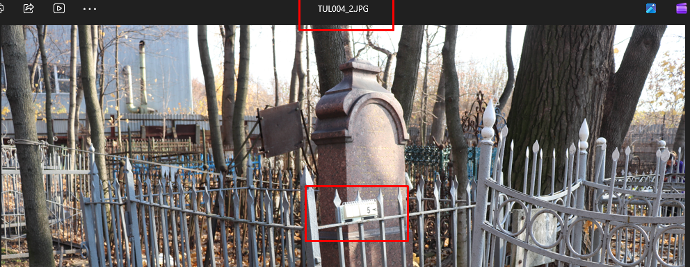

 Модель предсказала все правильно!!! Но данный пример записан в ошибку модели, хотя  это не ошибка модели, а изначальный (представленный заказчиком) файл содержит недостоверную информацию!!!!

 Или другой пример:
 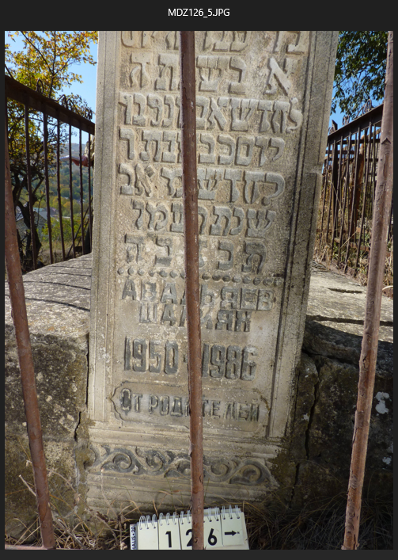

 Модель не считала закрытую двойку совсем, но с высокой уверенностью!!! (0.93 (среднее)) предсказала 1 и 6. Таким образом мы получили очень уверенный, но фактически не верный ответ!

 **ВЫВОД:** так как для этого проекта архиважно **не допустить ошибочного переименования файла**, считаю необходимым добавить ручное подтверждение перед переименованием.
## Работа приложения
Приложение сделано на Streamlit. Логика включает 4 шага.
- 1 шаг. Загрузка партиии фото: выбираем фото для загрузки (если все фото папки ctr+A), указываем перфикс (любой, например Тула_23_04_2026). Перфикс в данном решении используется для названия папки в которой выгрузятся результаты и уникального id в отчете о переименовании, но можно изменить код и добавлять перед именем. Нажимаем загрузить. Фото внутри приложения.

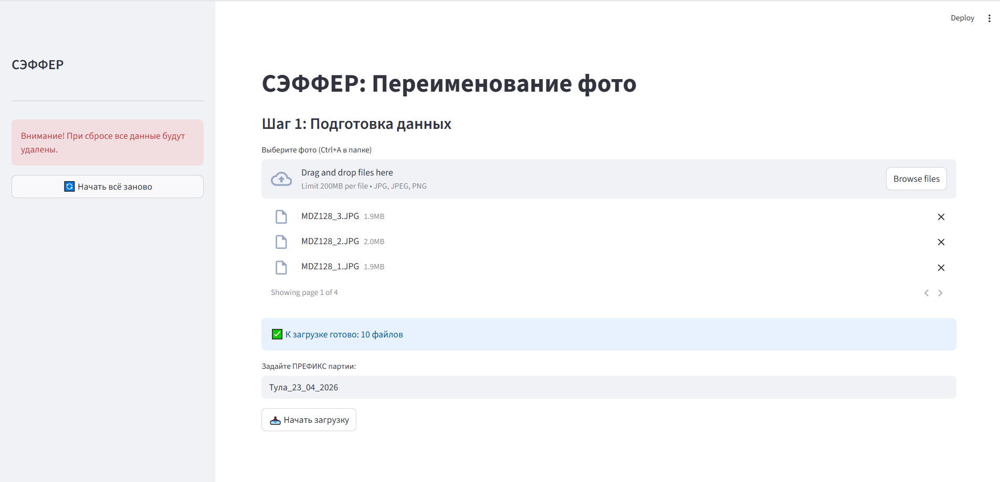
- 2 шаг. Запускаем нейронку: Моделька пробегает по всей партии и собирает данные в свой отчет. Помечает нераспознанное "!", добавляет "0" до 4-х знаков. После окончания ее работы приложение переходит на 3 шаг.

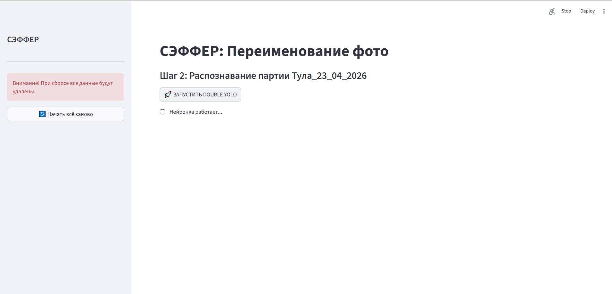
- 3 шаг. Ручное подтверждение: В интерфейс подтягивается последовательно текущее фото (еще предыдущее и последующее для того, что бы оператор не терял контекст объектов), подтягивается крупно кроп и предсказание модели. 2 кнопки - подтвердить (если предсказание верно) и ввести вручную, если модель ошиблась или таблички нет на кадре. При одинаковом номере, например 0123, перфиксы в конце _1 или _2 и т. д. модель добавит сама. Желательно дойти до конца партии без прерывания работы приложения. Вообще, в самом приложении предусмотрено сохранение прогресса, то есть можно вернуться к работе в любой момент, хоть через месяц. Но приложение упаковано в docker, а он диктует несколько свои условия. Поэтому прежде чем гарантировать сохранение прогресса необходимо тестирование. 

При верном предсказании просто кнопка подтвердить:
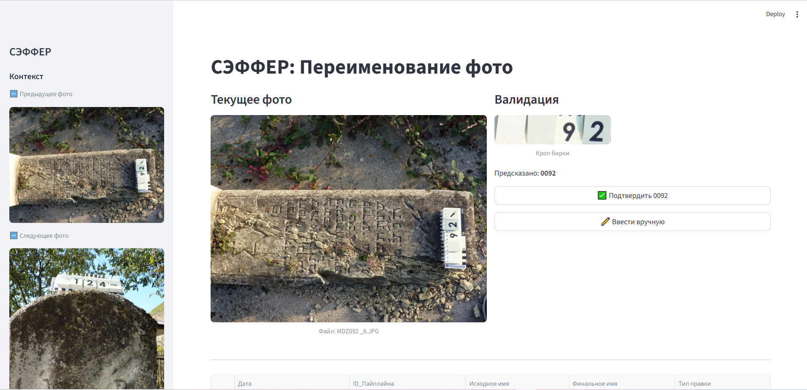

При ошибочном предсказаниит или отсутствии таблички на фото другая кнопка "ввести вручную":
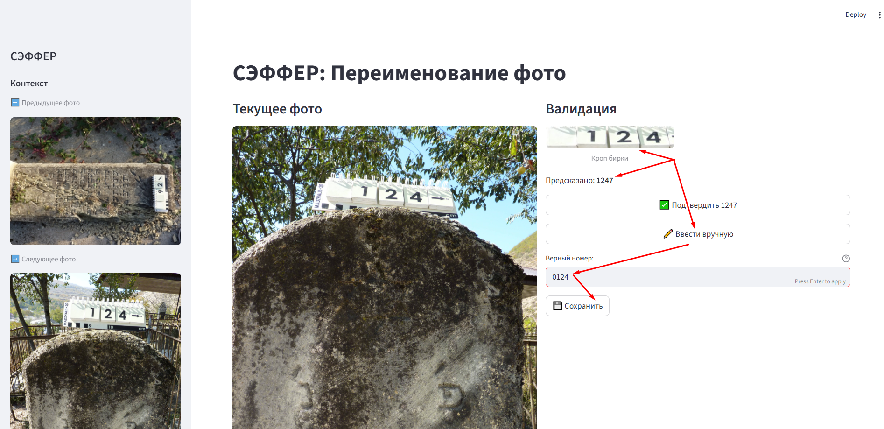
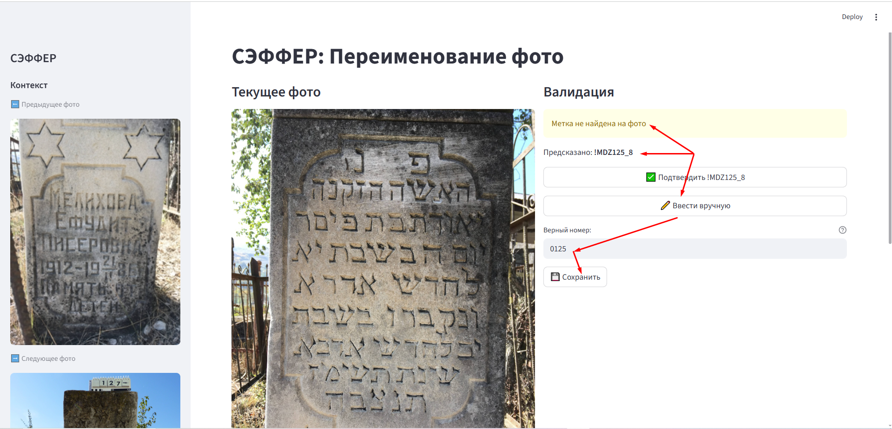

Таблица по переименованию в реальном времени. После каждого нажатия подтверждения добавляется новая строка:
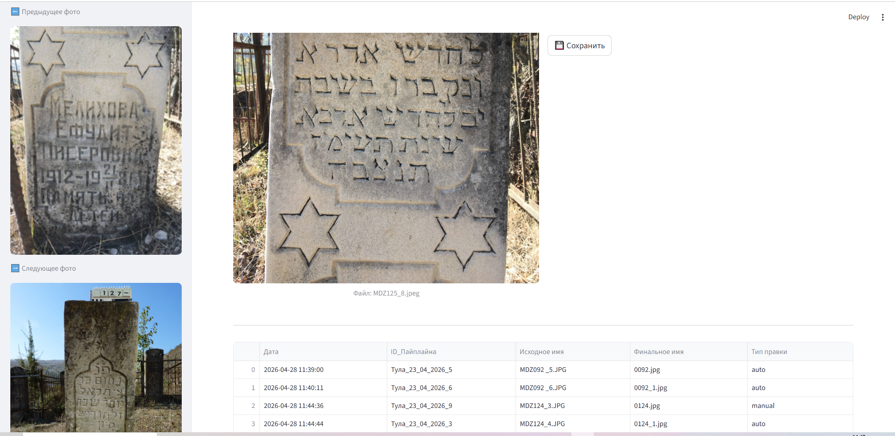
 - 4 шаг. Выгрузка результатов. При установке контейнера docker необходимо 1 раз указать папку куда будут выгружаться результаты. Эта папка фиксируется контейнером и должна оставаться неизменной всегда. Выгрузка осуществляется после того как вся партия прокликана. Формируется папка (имя - префикс, который задали на 1 шаге). Туда подгружаются переименованные файлы и excel отчет о переименовании (id, дата, старое имя, новое имя, метод авто или ручной). Есть возможность вместе с основными данными выгрузить технические (кропы, ocr, отчет нейронки) для отслеживания качества модели в боевои режиме. ВАЖНО! Кнопки выгрузки и "начать новую партию" очищают все внутренние папки контейнера. 

 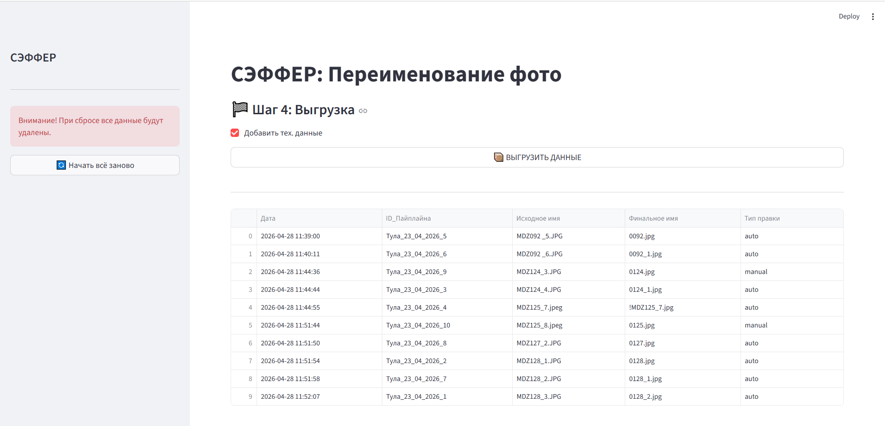

 Результат выгрузки:
 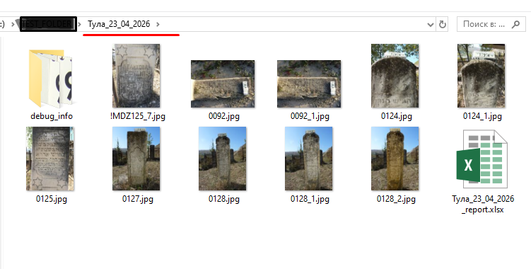

 Если галочка "выгрузить тех данные" установлена,то выгрузятся еще и кропы и ocr и датасет с результатами:
 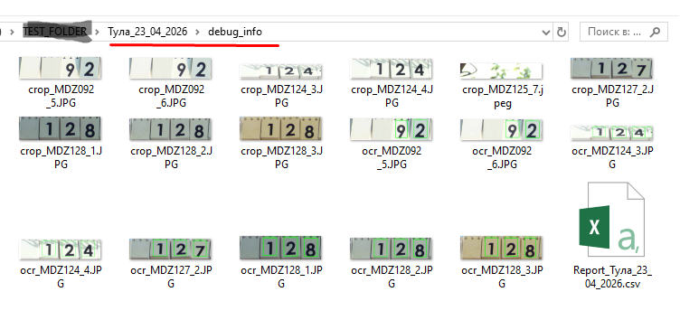

Во избежание нарушения логики переименования перемещаться между шагами можно только последовательно вперед. Начать заново можно, но прогресс будет потерян, внутренние папки очищены. Аналогично идет перемещение между фото.

Отчет о переименовании отображается под текущем фото и добавляет каждую новую строчку в реальном времени. Изменить что-то в отчете можно только после выгрузки. Так же как и устранить ошибки переименования, если таковые были сделаны оператором.

## Что можно улучшить:
- качество работы пайплайна за счет улучшения качества кропов. Можно дообучить модель с учетом особенностей, описанных выше (больше реальных фото, крупные таблички)
- улучшение качества данных может улучшить качество модели на 5-7%. Можно написать инструкции для фотографов.
- если на конкретном ПК фото при переименовании будет медленно подгружаться, можно уменьшить размер превьюшек (в приложении предусмотрена возможность открыть фото в исходном размере при необходимости)
- подкорректироваль логику приложения под пользователя
- улучшить дизайн приложения
## Примечания
- Модель обучена на специфических для этого проекта датасетах. При изменении шрифта или типа табличек поддерживать данное качество не представляется возможными.
- При финальном тестировании контейнера обнаружена ошибка: модель распознает буквы как цифры 10, 11, 12... При следующем релизе будет добавлен словарь для устранения ошибки.
- К обсуждению: модель обучена распознавать 4-х символьные таблички, считая 5-ый символ не актуальным. В нашем датасете есть кадры с 5-ю значимыми символами (4 цифры+1 буква, например 2018а) модель читает их как "2018" таких данных менее 1%. Можно дообучить ее на 5 символах, но тогда, с большой вероятностью качество на 4-х символьных ухудшится. 
 - К обсуждению: выявилось недопонимание логики переименования связанное с количеством символов в целом и цифр в частности. Сейчас пайплайн настроен так: если модель считала 64а, то после дополнения нулями это будет 064а (до 4-х символов) 
 **ВЫВОД:** Сейчас абсолютно все выявленные ошибки и модели и пайплайна и самих данных укладываются в менее чем 12%. Предполагается, что оператор укажет вручную порядка 144 имен из 1200. Остальные будут быстро прокликаны при автоматической подстановке правильного имени.